# Polyglot Codebase Knowledge Graph

> Generated offline by **readmenator**. 7 files, 85 symbols, 19 imports. Supports C, C++, Python, Go, Rust, JS/TS, Java, C#, Shell, PHP, Dart, GDScript, Nim, ASM, Ruby, Swift, Kotlin, Scala, Lua, Elixir.
> No LLMs. No tokens. Pure static analysis. See more [here](https://github.com/grisuno/ReadMenator)

**Start here:** Statistics Dashboard for scope, God Nodes for blast radius, Architecture Reference for per-file API. Agents: prefer `readmenator-agent/INDEX.md` + `SYMBOLS.md`.

**Wiki:** prefer `readmenator-wiki/index.md` for progressive disclosure: one synthesis page per community, `connections.json` with EXTRACTED vs INFERRED confidence, `queries.md` log, `REPORT.md` audit.

**Confidence:** EXTRACTED = parsed from source, INFERRED = heuristic bridge, AMBIGUOUS = reported, never hidden. See `readmenator-wiki/REPORT.md`.

**Total Files Parsed:** 7 | **Total Symbols Extracted:** 85 | **Total Imports:** 19

<!-- ranking_model: v1.0 | weights: {ppr:0.45,auth:0.2,test:0.15,doc:0.1,fresh:0.1} | alpha:0.85 | commit:05a4468 | date:2026-07-18 -->


## Table of Contents

1. [Statistics Dashboard](#statistics-dashboard)
2. [Architectural Layers](#architectural-layers)
3. [Ranked Context](#ranked-context)
4. [God Nodes](#god-nodes)
5. [Suggested Questions](#suggested-questions)
6. [Hotspot Analysis](#hotspot-analysis)
7. [Change Impact Analysis](#change-impact-analysis)
8. [Suggested Linting Rules](#suggested-linting-rules)
9. [Orphans](#orphans)
10. [Query Recipes](#query-recipes)
11. [Structural Knowledge Map](#structural-knowledge-map)
12. [UML Class Diagram](#uml-class-diagram)
13. [Code Property Graph](#code-property-graph)
14. [Architecture Reference](#architecture-reference)
    - [C (2 files)](#c-2-files)
    - [H (1 files)](#h-1-files)
    - [PY (1 files)](#py-1-files)
    - [S (2 files)](#s-2-files)
    - [SH (1 files)](#sh-1-files)

---

## Statistics Dashboard

| Metric | Value |
|--------|-------|
| Total Files | 7 |
| Total Symbols | 85 |
| Total Imports | 19 |
| Call Edges | 0 |
| Inheritance Edges | 0 |
| Languages | 5 |
| Avg Symbols/File | 12.1 |
| Avg Imports/File | 2.7 |

### Top Files by Import Count (Fan-Out)

| File | Imports | Symbols | Language |
|------|---------|---------|----------|
| `lazyc.c` | 16 | 71 | c |
| `beacon.h` | 2 | 13 | h |
| `module_hot.c` | 1 | 1 | c |

---

## Architectural Layers

Auto-detected from path patterns, naming conventions, and imported frameworks.

| Layer | Files |
|-------|-------|
| utility | 7 |

### utility

- `app.py` (py, 0 symbols)
- `beacon.h` (h, 13 symbols)
- `install.sh` (sh, 0 symbols)
- `lazyc.c` (c, 71 symbols)
- `lazyc.s` (s, 0 symbols)
- `lazyc2.s` (s, 0 symbols)
- `module_hot.c` (c, 1 symbols)

---

## Ranked Context

Files ranked by composite score for the current query context. The ranking combines Personalized PageRank (query relevance), global authority, test coverage, documentation coverage, and code freshness. Model: v1.0.

| Rank | File | Composite | PPR | Authority | Test | Doc |
|------|------|-----------|-----|-----------|------|-----|
| 1 | `app.py` | 0.1000 | 0.0000 | 0.0000 | 0.00 | 1.00 |
| 2 | `beacon.h` | 0.0231 | 0.0000 | 0.0000 | 0.00 | 0.23 |
| 3 | `lazyc.c` | 0.0169 | 0.0000 | 0.0000 | 0.00 | 0.17 |
| 4 | `install.sh` | 0.0000 | 0.0000 | 0.0000 | 0.00 | 0.00 |
| 5 | `lazyc.s` | 0.0000 | 0.0000 | 0.0000 | 0.00 | 0.00 |
| 6 | `lazyc2.s` | 0.0000 | 0.0000 | 0.0000 | 0.00 | 0.00 |
| 7 | `module_hot.c` | 0.0000 | 0.0000 | 0.0000 | 0.00 | 0.00 |

---

## God Nodes

Most architecturally central files ranked by combined import/export degree and symbol richness.

| File | Score | Connections | PageRank |
|------|-------|-------------|----------|
| `lazyc.c` | 7.1 | | 0.0000 |
| `beacon.h` | 1.3 | | 0.0000 |
| `module_hot.c` | 0.1 | | 0.0000 |
| `app.py` | 0.0 | | 0.0000 |
| `install.sh` | 0.0 | | 0.0000 |
| `lazyc.s` | 0.0 | | 0.0000 |
| `lazyc2.s` | 0.0 | | 0.0000 |

---

## Suggested Questions

Auto-generated exploration prompts based on graph structure:

- What does lazyc.c depend on, and what depends on it? (0 connections)
- What does beacon.h depend on, and what depends on it? (0 connections)
- What does module_hot.c depend on, and what depends on it? (0 connections)
- What is datap in beacon.h and how is it used?
- What is hotswap_config in lazyc.c and how is it used?

---

## Hotspot Analysis

Files ranked by combined complexity (symbol count) and centrality (connection count). High-scoring files are architecturally critical and may need refactoring attention.

| File | Complexity | Centrality | Combined | Symbols | Connections |
|------|-----------|------------|----------|---------|-------------|
| `app.py` | 0.000 | 0.000 | 0.000 | 0 | 0 |
| `beacon.h` | 0.183 | 0.125 | 0.148 | 13 | 2 |
| `lazyc.c` | 1.000 | 1.000 | 1.000 | 71 | 16 |
| `install.sh` | 0.000 | 0.000 | 0.000 | 0 | 0 |
| `lazyc.s` | 0.000 | 0.000 | 0.000 | 0 | 0 |
| `lazyc2.s` | 0.000 | 0.000 | 0.000 | 0 | 0 |
| `module_hot.c` | 0.014 | 0.062 | 0.043 | 1 | 1 |

---

## Change Impact Analysis

Files sorted by how many other files would be affected if they changed. High-impact files should be changed with caution.

| File | Direct Dependents | Transitive Dependents | Total Impact |
|------|------------------|----------------------|--------------|
| `app.py` | 0 | 0 | 0 |
| `beacon.h` | 0 | 0 | 0 |
| `install.sh` | 0 | 0 | 0 |
| `lazyc.c` | 0 | 0 | 0 |
| `lazyc.s` | 0 | 0 | 0 |
| `lazyc2.s` | 0 | 0 | 0 |
| `module_hot.c` | 0 | 0 | 0 |

---

## Suggested Linting Rules

Automatically suggested linting and security rules based on patterns detected in the codebase. These can be exported as Semgrep rules using the `--export-rules` flag.

| Rule ID | Severity | Description | Language | Matches |
|---------|----------|-------------|----------|---------|
| `RM001` | info | Large number of functions in h: 8 total | h | 8 |
| `RM002` | info | Large number of functions in c: 56 total | c | 56 |

---

## Orphans

Files with no documentation or low connectivity. These are candidates for documentation investment or cleanup.

- `install.sh` (0 symbols, no doc)
- `lazyc.s` (0 symbols, no doc)
- `lazyc2.s` (0 symbols, no doc)
- `module_hot.c` (1 symbols, no doc)

---

## Query Recipes

Example queries you can run against this knowledge base using the ranking engine:

```
# Find files most relevant to a concept
readmenator query "Where is the import resolver implemented?"

# Rank files by relevance to a topic
readmenator query "How does documentation generation work?"

# Explain why a file ranks highly
readmenator query "explain readmenator/_documentation.py"

# Trace dependency paths with ranked context
readmenator query "path from CLI to exporter"
```

The ranking model uses the following signals:

- **Personalized PageRank** (45% weight): query-specific relevance via seed propagation
- **Global Authority** (20% weight): structural importance via standard PageRank
- **Test Coverage** (15% weight): fraction of symbols referenced in test files
- **Doc Coverage** (10% weight): presence of docstrings and file-level docs
- **Freshness** (10% weight): recent modification activity

Results include score decomposition and justification paths for each ranked item.

---

## Structural Knowledge Map

```mermaid
graph TD
    classDef mod fill:#1e1e1e,stroke:#ff6666,stroke-width:2px,color:#fff;
    classDef cls fill:#2d2d2d,stroke:#4ec9b0,stroke-width:2px,color:#fff;
    classDef fn fill:#333,stroke:#dcdcaa,stroke-width:1px,color:#dcdcaa;
    classDef ext fill:#111,stroke:#666,stroke-dasharray:5 5,color:#aaa;
    lazyc_c["lazyc.c (c)"]
    class lazyc_c mod;
    lazyc_c_hotswap_config["hotswap_config"]
    class lazyc_c_hotswap_config cls;
    lazyc_c --> lazyc_c_hotswap_config
    lazyc_c_SymbolResolver["SymbolResolver"]
    class lazyc_c_SymbolResolver cls;
    lazyc_c --> lazyc_c_SymbolResolver
    lazyc_c_Trampoline["Trampoline"]
    class lazyc_c_Trampoline cls;
    lazyc_c --> lazyc_c_Trampoline
    lazyc_c_TrampolineCache["TrampolineCache"]
    class lazyc_c_TrampolineCache cls;
    lazyc_c --> lazyc_c_TrampolineCache
    lazyc_c_Symbol["Symbol"]
    class lazyc_c_Symbol cls;
    lazyc_c --> lazyc_c_Symbol
    beacon_h["beacon.h (h)"]
    class beacon_h mod;
    module_hot_c["module_hot.c (c)"]
    class module_hot_c mod;
    app_py["app.py (py)"]
    class app_py mod;
    install_sh["install.sh (sh)"]
    class install_sh mod;
    lazyc_s["lazyc.s (s)"]
    class lazyc_s mod;
    lazyc2_s["lazyc2.s (s)"]
    class lazyc2_s mod;
    ext_stdint_h["stdint.h"]
    class ext_stdint_h ext;
    beacon_h -.->|imports| ext_stdint_h
    ext_stdarg_h["stdarg.h"]
    class ext_stdarg_h ext;
    beacon_h -.->|imports| ext_stdarg_h
    ext_stdio_h["stdio.h"]
    class ext_stdio_h ext;
    lazyc_c -.->|imports| ext_stdio_h
    ext_stdlib_h["stdlib.h"]
    class ext_stdlib_h ext;
    lazyc_c -.->|imports| ext_stdlib_h
    ext_string_h["string.h"]
    class ext_string_h ext;
    lazyc_c -.->|imports| ext_string_h
    ext_errno_h["errno.h"]
    class ext_errno_h ext;
    lazyc_c -.->|imports| ext_errno_h
    ext_sys_mman_h["mman.h"]
    class ext_sys_mman_h ext;
    lazyc_c -.->|imports| ext_sys_mman_h
    ext_elf_h["elf.h"]
    class ext_elf_h ext;
    lazyc_c -.->|imports| ext_elf_h
    ext_dlfcn_h["dlfcn.h"]
    class ext_dlfcn_h ext;
    lazyc_c -.->|imports| ext_dlfcn_h
    lazyc_c -.->|imports| ext_stdint_h
    lazyc_c -.->|imports| ext_stdarg_h
    ext_sys_types_h["types.h"]
    class ext_sys_types_h ext;
    lazyc_c -.->|imports| ext_sys_types_h
    ext_sys_stat_h["stat.h"]
    class ext_sys_stat_h ext;
    lazyc_c -.->|imports| ext_sys_stat_h
    ext_fcntl_h["fcntl.h"]
    class ext_fcntl_h ext;
    lazyc_c -.->|imports| ext_fcntl_h
    ext_unistd_h["unistd.h"]
    class ext_unistd_h ext;
    lazyc_c -.->|imports| ext_unistd_h
    ext_sys_wait_h["wait.h"]
    class ext_sys_wait_h ext;
    lazyc_c -.->|imports| ext_sys_wait_h
    ext_limits_h["limits.h"]
    class ext_limits_h ext;
    lazyc_c -.->|imports| ext_limits_h
    ext_stddef_h["stddef.h"]
    class ext_stddef_h ext;
    lazyc_c -.->|imports| ext_stddef_h
    module_hot_c -.->|imports| ext_stdio_h
```



---

## UML Class Diagram

Auto-generated Mermaid class diagram from parsed class-level symbols. Shows classes, structs, interfaces, traits, and their methods with inheritance and dependency relationships.

```mermaid
classDiagram
  class beacon_h_datap {
    <<struct>>
    +BeaconDataParse(datap *parser, char *buffer, int size);
    +BeaconDataPtr(datap *parser, int size);
    +BeaconDataInt(datap *parser);
    +BeaconDataShort(datap *parser);
    +BeaconDataLength(datap *parser);
    +BeaconDataExtract(datap *parser, int *size);
    +BeaconPrintf(int type, const char *fmt, ...);
    +BeaconOutput(int type, const char *data, int len);
  }
  class lazyc_c_hotswap_config {
    <<struct>>
    +BeaconPrintf(int type, const char *fmt, ...)
    +BeaconOutput(int type, const char *data, int len)
    +create_trampoline(void *target)
    +cleanup_trampolines(void)
    +get_or_create_trampoline(void *target)
    +page_align(size_t size)
    +call_bof_isolated(void (*func)(char *, int), char *args, uintptr_t arglen)
    +resolve_external_symbols(void)
    +run_elf(const char *functionname, unsigned char *elf_data, uint32_t filesize,
        ...
    +run_elf_from_file(const char *filename, const char *funcname,
                        ...
  }
  class lazyc_c_SymbolResolver {
    <<struct>>
    +BeaconPrintf(int type, const char *fmt, ...)
    +BeaconOutput(int type, const char *data, int len)
    +create_trampoline(void *target)
    +cleanup_trampolines(void)
    +get_or_create_trampoline(void *target)
    +page_align(size_t size)
    +call_bof_isolated(void (*func)(char *, int), char *args, uintptr_t arglen)
    +resolve_external_symbols(void)
    +run_elf(const char *functionname, unsigned char *elf_data, uint32_t filesize,
        ...
    +run_elf_from_file(const char *filename, const char *funcname,
                        ...
  }
  class lazyc_c_Trampoline {
    <<struct>>
    +BeaconPrintf(int type, const char *fmt, ...)
    +BeaconOutput(int type, const char *data, int len)
    +create_trampoline(void *target)
    +cleanup_trampolines(void)
    +get_or_create_trampoline(void *target)
    +page_align(size_t size)
    +call_bof_isolated(void (*func)(char *, int), char *args, uintptr_t arglen)
    +resolve_external_symbols(void)
    +run_elf(const char *functionname, unsigned char *elf_data, uint32_t filesize,
        ...
    +run_elf_from_file(const char *filename, const char *funcname,
                        ...
  }
  class lazyc_c_TrampolineCache {
    <<struct>>
    +BeaconPrintf(int type, const char *fmt, ...)
    +BeaconOutput(int type, const char *data, int len)
    +create_trampoline(void *target)
    +cleanup_trampolines(void)
    +get_or_create_trampoline(void *target)
    +page_align(size_t size)
    +call_bof_isolated(void (*func)(char *, int), char *args, uintptr_t arglen)
    +resolve_external_symbols(void)
    +run_elf(const char *functionname, unsigned char *elf_data, uint32_t filesize,
        ...
    +run_elf_from_file(const char *filename, const char *funcname,
                        ...
  }
  class lazyc_c_Symbol {
    <<struct>>
    +BeaconPrintf(int type, const char *fmt, ...)
    +BeaconOutput(int type, const char *data, int len)
    +create_trampoline(void *target)
    +cleanup_trampolines(void)
    +get_or_create_trampoline(void *target)
    +page_align(size_t size)
    +call_bof_isolated(void (*func)(char *, int), char *args, uintptr_t arglen)
    +resolve_external_symbols(void)
    +run_elf(const char *functionname, unsigned char *elf_data, uint32_t filesize,
        ...
    +run_elf_from_file(const char *filename, const char *funcname,
                        ...
  }
  class lazyc_c_Macro {
    <<struct>>
    +BeaconPrintf(int type, const char *fmt, ...)
    +BeaconOutput(int type, const char *data, int len)
    +create_trampoline(void *target)
    +cleanup_trampolines(void)
    +get_or_create_trampoline(void *target)
    +page_align(size_t size)
    +call_bof_isolated(void (*func)(char *, int), char *args, uintptr_t arglen)
    +resolve_external_symbols(void)
    +run_elf(const char *functionname, unsigned char *elf_data, uint32_t filesize,
        ...
    +run_elf_from_file(const char *filename, const char *funcname,
                        ...
  }
  class lazyc_c_ParserState {
    <<struct>>
    +BeaconPrintf(int type, const char *fmt, ...)
    +BeaconOutput(int type, const char *data, int len)
    +create_trampoline(void *target)
    +cleanup_trampolines(void)
    +get_or_create_trampoline(void *target)
    +page_align(size_t size)
    +call_bof_isolated(void (*func)(char *, int), char *args, uintptr_t arglen)
    +resolve_external_symbols(void)
    +run_elf(const char *functionname, unsigned char *elf_data, uint32_t filesize,
        ...
    +run_elf_from_file(const char *filename, const char *funcname,
                        ...
  }
```



---

## Code Property Graph

Machine-readable Code Property Graph (CPG) in JSON-LD format. This block allows AI agents to parse the full structural graph without additional file reads. Compatible with GraphRAG pipelines.

```json
{"@context": "https://schema.org", "analysis": {"communities": [], "god_nodes": [{"node_id": "lazyc.c", "score": 7.1}, {"node_id": "beacon.h", "score": 1.3}, {"node_id": "module_hot.c", "score": 0.1}, {"node_id": "app.py", "score": 0.0}, {"node_id": "install.sh", "score": 0.0}, {"node_id": "lazyc.s", "score": 0.0}, {"node_id": "lazyc2.s", "score": 0.0}], "surprising_connections": []}, "edges": [{"confidence": "EXTRACTED", "relation": "imports", "source": "beacon.h", "target": "stdint.h"}, {"confidence": "EXTRACTED", "relation": "imports", "source": "beacon.h", "target": "stdarg.h"}, {"confidence": "EXTRACTED", "relation": "imports", "source": "lazyc.c", "target": "stdio.h"}, {"confidence": "EXTRACTED", "relation": "imports", "source": "lazyc.c", "target": "stdlib.h"}, {"confidence": "EXTRACTED", "relation": "imports", "source": "lazyc.c", "target": "string.h"}, {"confidence": "EXTRACTED", "relation": "imports", "source": "lazyc.c", "target": "errno.h"}, {"confidence": "EXTRACTED", "relation": "imports", "source": "lazyc.c", "target": "sys/mman.h"}, {"confidence": "EXTRACTED", "relation": "imports", "source": "lazyc.c", "target": "elf.h"}, {"confidence": "EXTRACTED", "relation": "imports", "source": "lazyc.c", "target": "dlfcn.h"}, {"confidence": "EXTRACTED", "relation": "imports", "source": "lazyc.c", "target": "stdint.h"}, {"confidence": "EXTRACTED", "relation": "imports", "source": "lazyc.c", "target": "stdarg.h"}, {"confidence": "EXTRACTED", "relation": "imports", "source": "lazyc.c", "target": "sys/types.h"}, {"confidence": "EXTRACTED", "relation": "imports", "source": "lazyc.c", "target": "sys/stat.h"}, {"confidence": "EXTRACTED", "relation": "imports", "source": "lazyc.c", "target": "fcntl.h"}, {"confidence": "EXTRACTED", "relation": "imports", "source": "lazyc.c", "target": "unistd.h"}, {"confidence": "EXTRACTED", "relation": "imports", "source": "lazyc.c", "target": "sys/wait.h"}, {"confidence": "EXTRACTED", "relation": "imports", "source": "lazyc.c", "target": "limits.h"}, {"confidence": "EXTRACTED", "relation": "imports", "source": "lazyc.c", "target": "stddef.h"}, {"confidence": "EXTRACTED", "relation": "imports", "source": "module_hot.c", "target": "stdio.h"}], "generator": "readmenator", "metadata": {"edge_count": 19, "file_count": 7, "language_count": 5, "symbol_count": 85}, "nodes": [{"doc": "app.py  Autor: Gris Iscomeback Correo electrónico: grisiscomeback[at]gmail[dot]com Fecha de creación: xx/xx/xxxx Licencia: GPL v3  Descripción:", "id": "app.py", "kind": "module", "label": "app.py", "language": "py", "sha256": "57b21bdb023585b8", "symbol_count": 0, "symbols": []}, {"doc": "beacon_api.h   Tipos de callback  Estructura para parsing de datos (opcional, para comandos complejos)", "id": "beacon.h", "kind": "module", "label": "beacon.h", "language": "h", "sha256": "38133982452f4d76", "symbol_count": 13, "symbols": [{"doc": "Estructura para parsing de datos (opcional, para comandos complejos)", "kind": "struct", "line": 14, "name": "datap"}, {"doc": "=== API para BOFs ===", "kind": "function", "line": 21, "name": "BeaconDataParse", "signature": "void BeaconDataParse(datap *parser, char *buffer, int size);"}, {"kind": "function", "line": 22, "name": "BeaconDataPtr", "signature": "char *BeaconDataPtr(datap *parser, int size);"}, {"kind": "function", "line": 23, "name": "BeaconDataInt", "signature": "int BeaconDataInt(datap *parser);"}, {"kind": "function", "line": 24, "name": "BeaconDataShort", "signature": "short BeaconDataShort(datap *parser);"}, {"kind": "function", "line": 25, "name": "BeaconDataLength", "signature": "int BeaconDataLength(datap *parser);"}, {"kind": "function", "line": 26, "name": "BeaconDataExtract", "signature": "char *BeaconDataExtract(datap *parser, int *size);"}, {"kind": "function", "line": 27, "name": "BeaconPrintf", "signature": "void BeaconPrintf(int type, const char *fmt, ...);"}, {"kind": "function", "line": 28, "name": "BeaconOutput", "signature": "void BeaconOutput(int type, const char *data, int len);"}, {"kind": "macro", "line": 3, "name": "BEACON_API_H", "signature": "#define BEACON_API_H"}, {"kind": "macro", "line": 9, "name": "CALLBACK_OUTPUT", "signature": "#define CALLBACK_OUTPUT"}, {"kind": "macro", "line": 10, "name": "CALLBACK_ERROR", "signature": "#define CALLBACK_ERROR"}, {"kind": "macro", "line": 11, "name": "CALLBACK_OUTPUT_OEM", "signature": "#define CALLBACK_OUTPUT_OEM"}]}, {"id": "install.sh", "kind": "module", "label": "install.sh", "language": "sh", "sha256": "c907d80fd6734993", "symbol_count": 0, "symbols": []}, {"id": "lazyc.c", "kind": "module", "label": "lazyc.c", "language": "c", "sha256": "c359bb6ffca4c036", "symbol_count": 71, "symbols": [{"doc": "Configuration structure – centralises all tunable parameters.", "kind": "struct", "line": 36, "name": "hotswap_config"}, {"doc": "Symbol resolver entry.", "kind": "struct", "line": 105, "name": "SymbolResolver"}, {"doc": "Trampoline structures for far calls.", "kind": "struct", "line": 141, "name": "Trampoline"}, {"kind": "struct", "line": 146, "name": "TrampolineCache"}, {"kind": "struct", "line": 714, "name": "Symbol"}, {"kind": "struct", "line": 769, "name": "Macro"}, {"kind": "struct", "line": 775, "name": "ParserState"}, {"doc": "Beacon API – capture output into global buffer.", "kind": "function", "line": 177, "name": "BeaconPrintf", "signature": "static void BeaconPrintf(int type, const char *fmt, ...)"}, {"kind": "function", "line": 193, "name": "BeaconOutput", "signature": "static void BeaconOutput(int type, const char *data, int len)"}, {"doc": "Trampoline creation and management.", "kind": "function", "line": 209, "name": "create_trampoline", "signature": "static void *create_trampoline(void *target)"}, {"kind": "function", "line": 241, "name": "cleanup_trampolines", "signature": "static void cleanup_trampolines(void)"}, {"kind": "function", "line": 256, "name": "get_or_create_trampoline", "signature": "static void *get_or_create_trampoline(void *target)"}, {"doc": "Page alignment utility.", "kind": "function", "line": 291, "name": "page_align", "signature": "static size_t page_align(size_t size)"}, {"doc": "Isolated call to BOF function with correct stack alignment.", "kind": "function", "line": 303, "name": "call_bof_isolated", "signature": "static void call_bof_isolated(void (*func)(char *, int), char *args, uintptr_t arglen)"}, {"doc": "Resolve all external symbols needed by the BOF.", "kind": "function", "line": 335, "name": "resolve_external_symbols", "signature": "static int resolve_external_symbols(void)"}, {"doc": "Core ELF loader: maps sections, resolves relocations, executes entry point.", "kind": "function", "line": 353, "name": "run_elf", "signature": "static int run_elf(const char *functionname, unsigned char *elf_data, uint32_t filesize,\n        ..."}, {"doc": "Convenience wrapper: load ELF from file and run.", "kind": "function", "line": 612, "name": "run_elf_from_file", "signature": "static int run_elf_from_file(const char *filename, const char *funcname,\n                        ..."}, {"doc": "Error handling.", "kind": "function", "line": 846, "name": "error", "signature": "static void error(const char *msg)"}, {"kind": "function", "line": 851, "name": "safe_malloc", "signature": "static void *safe_malloc(size_t size)"}, {"kind": "function", "line": 860, "name": "my_isspace", "signature": "static int my_isspace(int c)"}, {"kind": "function", "line": 865, "name": "my_isalpha", "signature": "static int my_isalpha(int c)"}, {"kind": "function", "line": 869, "name": "my_isdigit", "signature": "static int my_isdigit(int c)"}, {"kind": "function", "line": 873, "name": "my_isalnum", "signature": "static int my_isalnum(int c)"}, {"kind": "function", "line": 877, "name": "find_macro", "signature": "static int find_macro(const char *name)"}, {"kind": "function", "line": 885, "name": "add_macro", "signature": "static void add_macro(const char *name, int value)"}, {"kind": "function", "line": 896, "name": "save_parser_state", "signature": "static void save_parser_state(ParserState *state)"}, {"kind": "function", "line": 920, "name": "restore_parser_state", "signature": "static void restore_parser_state(ParserState *state)"}, {"kind": "function", "line": 944, "name": "next_token", "signature": "static void next_token(void)"}, {"kind": "function", "line": 1169, "name": "match", "signature": "static void match(int expected)"}, {"kind": "function", "line": 1174, "name": "emit", "signature": "static void emit(const char *s)"}, {"kind": "function", "line": 1188, "name": "emit_i", "signature": "static void emit_i(const char *fmt, int v)"}, {"kind": "function", "line": 1194, "name": "emit_s", "signature": "static void emit_s(const char *fmt, const char *s)"}, {"kind": "function", "line": 1200, "name": "emit_is", "signature": "static void emit_is(const char *fmt, int v, const char *s)"}, {"kind": "function", "line": 1206, "name": "emit_si", "signature": "static void emit_si(const char *fmt, const char *s, int v)"}, {"kind": "function", "line": 1212, "name": "emit_label", "signature": "static void emit_label(int label)"}, {"kind": "function", "line": 1217, "name": "find_symbol", "signature": "static int find_symbol(const char *name)"}, {"kind": "function", "line": 1225, "name": "add_symbol", "signature": "static void add_symbol(const char *name, int is_global, int size, int pointed,\n                  ..."}, {"kind": "function", "line": 1259, "name": "arg_reg", "signature": "static const char *arg_reg(int i)"}, {"kind": "function", "line": 1268, "name": "libc_global_name", "signature": "static const char *libc_global_name(int i)"}, {"kind": "function", "line": 1281, "name": "unary", "signature": "static void unary(void)"}, {"kind": "function", "line": 1435, "name": "lvalue_address", "signature": "static void lvalue_address(void)"}, {"kind": "function", "line": 1480, "name": "handle_postfix", "signature": "static void handle_postfix(int is_lvalue)"}, {"kind": "function", "line": 1581, "name": "unary_expr", "signature": "static void unary_expr(void)"}, {"kind": "function", "line": 1586, "name": "multiplicative_expr", "signature": "static void multiplicative_expr(void)"}, {"kind": "function", "line": 1612, "name": "additive_expr", "signature": "static void additive_expr(void)"}, {"kind": "function", "line": 1630, "name": "relational_expr", "signature": "static void relational_expr(void)"}, {"kind": "function", "line": 1648, "name": "equality_expr", "signature": "static void equality_expr(void)"}, {"kind": "function", "line": 1664, "name": "bitwise_and_expr", "signature": "static void bitwise_and_expr(void)"}, {"kind": "function", "line": 1676, "name": "bitwise_xor_expr", "signature": "static void bitwise_xor_expr(void)"}, {"kind": "function", "line": 1688, "name": "bitwise_or_expr", "signature": "static void bitwise_or_expr(void)"}, {"kind": "function", "line": 1700, "name": "logical_and_expr", "signature": "static void logical_and_expr(void)"}, {"kind": "function", "line": 1720, "name": "logical_or_expr", "signature": "static void logical_or_expr(void)"}, {"kind": "function", "line": 1740, "name": "conditional_expr", "signature": "static void conditional_expr(void)"}, {"kind": "function", "line": 1758, "name": "assignment_expr", "signature": "static void assignment_expr(void)"}, {"kind": "function", "line": 1992, "name": "statement", "signature": "static void statement(void)"}, {"kind": "function", "line": 2576, "name": "parse_function", "signature": "static void parse_function(const char *name, int ret_type)"}, {"kind": "function", "line": 2696, "name": "parse_enum", "signature": "static void parse_enum(void)"}, {"kind": "function", "line": 2733, "name": "skip_struct", "signature": "static void skip_struct(void)"}, {"kind": "function", "line": 2787, "name": "skip_typedef", "signature": "static void skip_typedef(void)"}, {"kind": "function", "line": 2825, "name": "parse_program", "signature": "static void parse_program(void)"}, {"kind": "function", "line": 2954, "name": "emit_string_pool", "signature": "static void emit_string_pool(void)"}, {"doc": "Main entry point – can act as compiler or hotswap loader.", "kind": "function", "line": 2977, "name": "main", "signature": "int main(int argc, char **argv)"}, {"kind": "macro", "line": 664, "name": "MAX_TOKEN_LEN", "signature": "#define MAX_TOKEN_LEN"}, {"kind": "macro", "line": 665, "name": "MAX_SYMBOLS", "signature": "#define MAX_SYMBOLS"}, {"kind": "macro", "line": 666, "name": "MAX_IDENT_LEN", "signature": "#define MAX_IDENT_LEN"}, {"kind": "macro", "line": 667, "name": "MAX_SOURCE_SIZE", "signature": "#define MAX_SOURCE_SIZE"}, {"kind": "macro", "line": 668, "name": "STACK_ALIGN", "signature": "#define STACK_ALIGN"}, {"kind": "macro", "line": 740, "name": "MAX_CASES_PER_SWITCH", "signature": "#define MAX_CASES_PER_SWITCH"}, {"kind": "macro", "line": 753, "name": "MAX_STRINGS", "signature": "#define MAX_STRINGS"}, {"kind": "macro", "line": 757, "name": "MAX_STRUCT_MEMBERS", "signature": "#define MAX_STRUCT_MEMBERS"}, {"kind": "macro", "line": 767, "name": "MAX_MACROS", "signature": "#define MAX_MACROS"}]}, {"id": "lazyc.s", "kind": "module", "label": "lazyc.s", "language": "s", "sha256": "073e897ba68ce0db", "symbol_count": 0, "symbols": []}, {"id": "lazyc2.s", "kind": "module", "label": "lazyc2.s", "language": "s", "sha256": "60b50457ca3a2af9", "symbol_count": 0, "symbols": []}, {"id": "module_hot.c", "kind": "module", "label": "module_hot.c", "language": "c", "sha256": "1fee4263ba883af3", "symbol_count": 1, "symbols": [{"kind": "function", "line": 3, "name": "go", "signature": "void go(char *args, int arglen)"}]}], "type": "CodePropertyGraph", "version": "1.0"}
```

---

## Architecture Reference

### C (2 files)

#### `lazyc.c`
**Path:** `lazyc.c`

**Functions:**
- `BeaconPrintf` (line 177) `static void BeaconPrintf(int type, const char *fmt, ...)` - *Beacon API – capture output into global buffer.*
- `BeaconOutput` (line 193) `static void BeaconOutput(int type, const char *data, int len)`
- `create_trampoline` (line 209) `static void *create_trampoline(void *target)` - *Trampoline creation and management.*
- `cleanup_trampolines` (line 241) `static void cleanup_trampolines(void)`
- `get_or_create_trampoline` (line 256) `static void *get_or_create_trampoline(void *target)`
- `page_align` (line 291) `static size_t page_align(size_t size)` - *Page alignment utility.*
- `call_bof_isolated` (line 303) `static void call_bof_isolated(void (*func)(char *, int), char *args, uintptr_t arglen)` - *Isolated call to BOF function with correct stack alignment.*
- `resolve_external_symbols` (line 335) `static int resolve_external_symbols(void)` - *Resolve all external symbols needed by the BOF.*
- `run_elf` (line 353) `static int run_elf(const char *functionname, unsigned char *elf_data, uint32_t filesize,
        ...` - *Core ELF loader: maps sections, resolves relocations, executes entry point.*
- `run_elf_from_file` (line 612) `static int run_elf_from_file(const char *filename, const char *funcname,
                        ...` - *Convenience wrapper: load ELF from file and run.*
- `error` (line 846) `static void error(const char *msg)` - *Error handling.*
- `safe_malloc` (line 851) `static void *safe_malloc(size_t size)`
- `my_isspace` (line 860) `static int my_isspace(int c)`
- `my_isalpha` (line 865) `static int my_isalpha(int c)`
- `my_isdigit` (line 869) `static int my_isdigit(int c)`
- `my_isalnum` (line 873) `static int my_isalnum(int c)`
- `find_macro` (line 877) `static int find_macro(const char *name)`
- `add_macro` (line 885) `static void add_macro(const char *name, int value)`
- `save_parser_state` (line 896) `static void save_parser_state(ParserState *state)`
- `restore_parser_state` (line 920) `static void restore_parser_state(ParserState *state)`
- `next_token` (line 944) `static void next_token(void)`
- `match` (line 1169) `static void match(int expected)`
- `emit` (line 1174) `static void emit(const char *s)`
- `emit_i` (line 1188) `static void emit_i(const char *fmt, int v)`
- `emit_s` (line 1194) `static void emit_s(const char *fmt, const char *s)`
- `emit_is` (line 1200) `static void emit_is(const char *fmt, int v, const char *s)`
- `emit_si` (line 1206) `static void emit_si(const char *fmt, const char *s, int v)`
- `emit_label` (line 1212) `static void emit_label(int label)`
- `find_symbol` (line 1217) `static int find_symbol(const char *name)`
- `add_symbol` (line 1225) `static void add_symbol(const char *name, int is_global, int size, int pointed,
                  ...`
- `arg_reg` (line 1259) `static const char *arg_reg(int i)`
- `libc_global_name` (line 1268) `static const char *libc_global_name(int i)`
- `unary` (line 1281) `static void unary(void)`
- `lvalue_address` (line 1435) `static void lvalue_address(void)`
- `handle_postfix` (line 1480) `static void handle_postfix(int is_lvalue)`
- `unary_expr` (line 1581) `static void unary_expr(void)`
- `multiplicative_expr` (line 1586) `static void multiplicative_expr(void)`
- `additive_expr` (line 1612) `static void additive_expr(void)`
- `relational_expr` (line 1630) `static void relational_expr(void)`
- `equality_expr` (line 1648) `static void equality_expr(void)`
- `bitwise_and_expr` (line 1664) `static void bitwise_and_expr(void)`
- `bitwise_xor_expr` (line 1676) `static void bitwise_xor_expr(void)`
- `bitwise_or_expr` (line 1688) `static void bitwise_or_expr(void)`
- `logical_and_expr` (line 1700) `static void logical_and_expr(void)`
- `logical_or_expr` (line 1720) `static void logical_or_expr(void)`
- `conditional_expr` (line 1740) `static void conditional_expr(void)`
- `assignment_expr` (line 1758) `static void assignment_expr(void)`
- `statement` (line 1992) `static void statement(void)`
- `parse_function` (line 2576) `static void parse_function(const char *name, int ret_type)`
- `parse_enum` (line 2696) `static void parse_enum(void)`
- `skip_struct` (line 2733) `static void skip_struct(void)`
- `skip_typedef` (line 2787) `static void skip_typedef(void)`
- `parse_program` (line 2825) `static void parse_program(void)`
- `emit_string_pool` (line 2954) `static void emit_string_pool(void)`
- `main` (line 2977) `int main(int argc, char **argv)` - *Main entry point – can act as compiler or hotswap loader.*

**Macros:**
- `MAX_TOKEN_LEN` (line 664) `#define MAX_TOKEN_LEN`
- `MAX_SYMBOLS` (line 665) `#define MAX_SYMBOLS`
- `MAX_IDENT_LEN` (line 666) `#define MAX_IDENT_LEN`
- `MAX_SOURCE_SIZE` (line 667) `#define MAX_SOURCE_SIZE`
- `STACK_ALIGN` (line 668) `#define STACK_ALIGN`
- `MAX_CASES_PER_SWITCH` (line 740) `#define MAX_CASES_PER_SWITCH`
- `MAX_STRINGS` (line 753) `#define MAX_STRINGS`
- `MAX_STRUCT_MEMBERS` (line 757) `#define MAX_STRUCT_MEMBERS`
- `MAX_MACROS` (line 767) `#define MAX_MACROS`

**Structs:**
- `hotswap_config` (line 36) - *Configuration structure – centralises all tunable parameters.*
- `SymbolResolver` (line 105) - *Symbol resolver entry.*
- `Trampoline` (line 141) - *Trampoline structures for far calls.*
- `TrampolineCache` (line 146)
- `Symbol` (line 714)
- `Macro` (line 769)
- `ParserState` (line 775)

#### `module_hot.c`
**Path:** `module_hot.c`

**Functions:**
- `go` (line 3) `void go(char *args, int arglen)`

### H (1 files)

#### `beacon.h`
**Path:** `beacon.h`
**File Doc:** *beacon_api.h   Tipos de callback  Estructura para parsing de datos (opcional, para comandos complejos)*

**Functions:**
- `BeaconDataParse` (line 21) `void BeaconDataParse(datap *parser, char *buffer, int size);` - *=== API para BOFs ===*
- `BeaconDataPtr` (line 22) `char *BeaconDataPtr(datap *parser, int size);`
- `BeaconDataInt` (line 23) `int BeaconDataInt(datap *parser);`
- `BeaconDataShort` (line 24) `short BeaconDataShort(datap *parser);`
- `BeaconDataLength` (line 25) `int BeaconDataLength(datap *parser);`
- `BeaconDataExtract` (line 26) `char *BeaconDataExtract(datap *parser, int *size);`
- `BeaconPrintf` (line 27) `void BeaconPrintf(int type, const char *fmt, ...);`
- `BeaconOutput` (line 28) `void BeaconOutput(int type, const char *data, int len);`

**Macros:**
- `BEACON_API_H` (line 3) `#define BEACON_API_H`
- `CALLBACK_OUTPUT` (line 9) `#define CALLBACK_OUTPUT`
- `CALLBACK_ERROR` (line 10) `#define CALLBACK_ERROR`
- `CALLBACK_OUTPUT_OEM` (line 11) `#define CALLBACK_OUTPUT_OEM`

**Structs:**
- `datap` (line 14) - *Estructura para parsing de datos (opcional, para comandos complejos)*

### PY (1 files)

#### `app.py`
**Path:** `app.py`
**File Doc:** *app.py  Autor: Gris Iscomeback Correo electrónico: grisiscomeback[at]gmail[dot]com Fecha de creación: xx/xx/xxxx Licencia: GPL v3  Descripción:*

*No symbols extracted*

### S (2 files)

#### `lazyc.s`
**Path:** `lazyc.s`

*No symbols extracted*

#### `lazyc2.s`
**Path:** `lazyc2.s`

*No symbols extracted*

### SH (1 files)

#### `install.sh`
**Path:** `install.sh`

*No symbols extracted*
